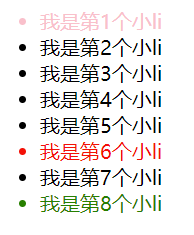
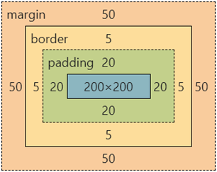

# day05-盒子模型

> 目标：掌握盒子模型组成部分，使用盒子模型布局网页区域

## 01-选择器

### 结构伪类选择器 

### 基本使用

作用：根据元素的**结构关系**查找元素。 


```css
<!DOCTYPE html>
<html lang="en">

<head>
  <meta charset="UTF-8">
  <meta http-equiv="X-UA-Compatible" content="IE=edge">
  <meta name="viewport" content="width=device-width, initial-scale=1.0">
  <title>Document</title>
  <style>
    /* 结构伪类选择器 */
    /* 1.选择第一个li */
    ul li:first-child {
      color: pink;
    }

    /* 2. 最后一个小li */
    ul li:last-child {
      color: green;
    }

    /* 3. 选择其中任意一个 */
    ul li:nth-child(6) {
      color: red;
    }
  </style>
</head>

<body>
  <!-- ul>li{第$个}*8 -->
  <ul>
    <li>我是第1个小li</li>
    <li>我是第2个小li</li>
    <li>我是第3个小li</li>
    <li>我是第4个小li</li>
    <li>我是第5个小li</li>
    <li>我是第6个小li</li>
    <li>我是第7个小li</li>
    <li>我是第8个小li</li>
  </ul>
</body>

</html>
```

 

### :nth-child(公式) 


> 提示：公式中的n取值从 **0** 开始。 

~~~html
<!DOCTYPE html>
<html lang="en">

<head>
  <meta charset="UTF-8">
  <meta http-equiv="X-UA-Compatible" content="IE=edge">
  <meta name="viewport" content="width=device-width, initial-scale=1.0">
  <title>Document</title>
  <style>
    /* 公式 */
    /* 2n 是偶数个 */


    ul li:nth-child(2n) {
      background-color: #eee;
    }

    ul li:hover {
      background-color: #bbb;
    }


    /* 2n+1 奇数 */
    /* ul li:nth-child(2n + 1) {
      background-color: #eee;
    } */

    /* 5n 5的倍数 */
    /* ul li:nth-child(5n) {
      background-color: #eee;
    } */

    /* -n+5 选择第5个以前的 包含第5个 */
    /* ul li:nth-child(-n + 5) {
      background-color: #eee;
    } */

    /* n+5 选择第5个以后的 包含第5个 */
    /* ul li:nth-child(n + 5) {
      background-color: #eee;
    } */
  </style>
</head>

<body>
  <ul>
    <li>我是第1个小li</li>
    <li>我是第2个小li</li>
    <li>我是第3个小li</li>
    <li>我是第4个小li</li>
    <li>我是第5个小li</li>
    <li>我是第6个小li</li>
    <li>我是第7个小li</li>
    <li>我是第8个小li</li>
    <li>我是第9个小li</li>
    <li>我是第10个小li</li>
    <li>我是第11个小li</li>
    <li>我是第12个小li</li>
    <li>我是第13个小li</li>
    <li>我是第14个小li</li>
    <li>我是第15个小li</li>
  </ul>
</body>

</html>
~~~


### 伪元素选择器 

作用：创建**虚拟元素**（伪元素），用来**摆放装饰性的内容**。 


```css
div::before {
  content: "before 伪元素";
}
div::after {
  content: "after 伪元素";
}
```

注意点：

* 必须设置 **content: ””属性**，用来 设置伪元素的内容，如果没有内容，则**引号留空**即可
* 伪元素默认是**行内**显示模式
* **权重和标签选择器相同**

## 02-PxCook 

PxCook（像素大厨） 是一款切图设计工具软件。支持PSD文件的文字、颜色、距离自动智能识别。

* 开发面板（自动智能识别）
* 设计面板（手动测量尺寸和颜色）

使用方法：创建项目 → 输入 项目名称、项目类型 Web → 单击按钮【创建项目】 → 单击按钮【添加】，导入设计稿 


## 03-盒子模型

作用：布局网页，摆放盒子和内容。

### 盒子模型-组成

* 内容区域 – width & height
* 内边距 – padding（出现在内容与盒子边缘之间）
* 边框线 – border 
* 外边距 – margin（出现在盒子外面）

```css
div {
  margin: 50px;
  border: 5px solid brown;
  padding: 20px;
  width: 200px;
  height: 200px;
  background-color: pink;
}
```





### 边框线

#### 四个方向

属性名：**border**（bd）

属性值：边框线粗细  线条样式  颜色（不区分顺序）


```css
div {
  border: 5px solid brown;
  width: 200px;
  height: 200px;
  background-color: pink;
}
```

#### 单方向边框线 

属性名：**border-方位名词**（bd+方位名词首字母，例如，bdl）

属性值：边框线粗细  线条样式  颜色（不区分顺序）

```css
div {
  border-top: 2px solid red;
  border-right: 3px dashed green;
  border-bottom: 4px dotted blue;
  border-left: 5px solid orange;
  width: 200px;
  height: 200px;
  background-color: pink;
}
```

### 内边距 

作用：设置 内容 与 盒子边缘 之间的距离。

* 属性名：padding / padding-方位名词

```css
div {
  /* 四个方向 内边距相同 */
  padding: 30px;
  /* 单独设置一个方向内边距 */
  padding-top: 10px;
  padding-right: 20px;
  padding-bottom: 40px;
  padding-left: 80px;
  width: 200px;
  height: 200px;
  background-color: pink;
}
```

> 提示：添加 padding 会撑大盒子。

* padding 多值写法


> 技巧：从**上**开始**顺时针**赋值，当前方向没有数值则与**对面取值相同**。 

~~~html
<!DOCTYPE html>
<html lang="en">

<head>
  <meta charset="UTF-8">
  <meta http-equiv="X-UA-Compatible" content="IE=edge">
  <meta name="viewport" content="width=device-width, initial-scale=1.0">
  <title>Document</title>
  <style>
    .box {
      /* 1. 手动去减 */
      /* width: 160px;
      height: 160px; */
      /* 2. css3 盒子模型 box-sizing: border-box */
      box-sizing: border-box;
      width: 200px;
      height: 200px;
      background-color: pink;
      border: 10px solid red;
      padding: 10px;
    }
  </style>
</head>

<body>
  <div class="box">qwe</div>
</body>

</html>
~~~


### 尺寸计算


默认情况：盒子尺寸 = 内容尺寸 + border 尺寸 + 内边距尺寸

结论：给盒子加 border / padding 会撑大盒子

解决：

* 手动做减法，减掉 border / padding 的尺寸
* 內减模式：**box-sizing: border-box**

### 外边距 

作用：拉开两个盒子之间的距离

属性名：**margin**

提示：与 padding 属性值写法、含义相同

### 版心居中


左右 margin 值 为 auto（盒子要有宽度）

```css
div {
  margin: 0 auto;
  width: 1000px;
  height: 200px;
  background-color: pink;
}
```

>1. 行内和行内块元素水平居中对齐，给块级的父元素添加  tac 
>2. 块级元素水平居中对齐： 让盒子的`左右外边距`设置为 auto 就可以了。  margin: auto;
>   - 小米  margin-left: auto;  margin-right: auto;
>   - 京东/淘宝： margin： 0 auto；


### 清除默认样式 


清除标签默认的样式，比如：默认的内外边距。 


```css
/* 清除默认内外边距 */
* {
  margin: 0;
  padding: 0;
  box-sizing: border-box;
}
/* 清除列表项目符号 */
li {
  list-style: none;
}
```

### 元素溢出

作用：控制溢出元素的内容的显示方式。

属性名：**overflow**


### 外边距问题

#### 合并现象

场景：**垂直**排列的兄弟元素，上下 **margin** 会**合并**

现象：取两个 margin 中的**较大值生效**


```css
.one {
  margin-bottom: 50px;
}
.two {
  margin-top: 20px;
}
```

#### 外边距塌陷

场景：父子级的标签，子级的添加 **上外边距** 会产生**塌陷**问题

现象：**导致父级一起向下移动**

```css
.son {
  margin-top: 50px;
  width: 100px;
  height: 100px;
  background-color: orange;
}
```


解决方法：

* 取消子级margin，父级设置padding
* 父级设置 overflow: hidden
* 父级设置 border-top

### 行内元素 – 内外边距问题 

场景：行内元素添加 margin 和 padding，无法改变元素垂直位置

解决方法：给行内元素添加 **line-height** 可以改变垂直位置

```css
span {
  /* margin 和 padding 属性，无法改变垂直位置 */
  margin: 50px;
  padding: 20px;
  /* 行高可以改变垂直位置 */
  line-height: 100px;
}
```

### 圆角

作用：设置元素的外边框为圆角。

属性名：**border-radius**

属性值：数字+px / 百分比

提示：属性值是圆角半径


* 多值写法


> 技巧：从左上角开始顺时针赋值，当前角没有数值则与对角取值相同。 

* 正圆形状：给正方形盒子设置圆角属性值为 **宽高的一半 / 50%**

```css
img {
  width: 200px;
  height: 200px;
  
  border-radius: 100px;
  border-radius: 50%;
}
```


* 胶囊形状：给长方形盒子设置圆角属性值为 盒子高度的一半 

```css
div {
  width: 200px;
  height: 80px;
  background-color: orange;
  border-radius: 40px;
}
```


### 盒子阴影（拓展）

作用：给元素设置阴影效果

属性名：**box-shadow**

属性值：X 轴偏移量  Y 轴偏移量  模糊半径  扩散半径  颜色  内外阴影

注意： 

* X 轴偏移量 和 Y 轴偏移量 必须书写
* 默认是外阴影，内阴影需要添加 inset

```css
div {
  width: 200px;
  height: 80px;
  background-color: orange;
  box-shadow: 2px 5px 10px 0 rgba(0, 0, 0, 0.5) inset;
}
```

## 04-综合案例-产品卡片


CSS 书写顺序：

1. 盒子模型属性
2. 文字样式
3. 圆角、阴影等修饰属性

### HTML标签

```html
<div class="product">
  
  <h4>抖音直播SDK</h4>
  <p>包含抖音直播看播功能</p>
</div>
```


### CSS样式

```html
<style>
  * {
    margin: 0;
    padding: 0;
    box-sizing: border-box;
  }

  body {
    background-color: #f1f1f1;
  }

  .product {
    margin: 50px auto;
    padding-top: 40px;

    width: 270px;
    height: 253px;
    background-color: #fff;
    text-align: center;

    border-radius: 10px;
  }

  .product h4 {
    margin-top: 20px;
    margin-bottom: 12px;
    font-size: 18px;
    color: #333;
    font-weight: 400;
  }

  .product p {
    font-size: 12px;
    color: #555;
  }
</style>
```

## 05-综合案例二 – 新闻列表 


### 整体布局

```html
<style>
* {
  margin: 0;
  padding: 0;
  box-sizing: border-box;
}

li {
  list-style: none;
}

a {
  text-decoration: none;
}

.news {
  margin: 100px auto;
  width: 360px;
  height: 200px;
  /* background-color: pink; */
}
</style>

<div class="news"></div>
```

### 标题区域

```html
<style>
.news .hd {
  height: 34px;
  background-color: #eee;
  border: 1px solid #dbdee1;
  border-left: 0;
}

.news .hd a {
  /* -1 盒子向上移动 */
  margin-top: -1px;
  display: block;
  border-top: 3px solid #ff8400;
  border-right: 1px solid #dbdee1;
  width: 48px;
  height: 34px;
  background-color: #fff;

  text-align: center;
  line-height: 32px;
  font-size: 14px;
  color: #333;
}
</style>

<div class="hd"><a href="#">新闻</a></div>
```

### 内容区域

```html
<style>
.news .bd {
  padding: 5px;
}

.news .bd li {
  padding-left: 15px;
  background-image: url(./images/square.png);
  background-repeat: no-repeat;
  background-position: 0 center;
}

.news .bd li a {
  padding-left: 20px;
  background: url(./images/img.gif) no-repeat 0 center;

  font-size: 12px;
  color: #666;
  line-height: 24px;
}

.news .bd li a:hover {
  color: #ff8400;
}
</style>

<div class="bd">
  <ul>
    <li><a href="#">点赞“新农人” 温暖的伸手</a></li>
    <li><a href="#">在希望的田野上...</a></li>
    <li><a href="#">“中国天眼”又有新发现 已在《自然》杂志发表</a></li>
    <li><a href="#">急！这个领域，缺人！月薪4万元还不好招！啥情况？</a></li>
    <li><a href="#">G9“带货”背后：亏损面持续扩大，竞争环境激烈</a></li>
    <li><a href="#">多地力推二手房“带押过户”，有什么好处？</a></li>
  </ul>
</div>
```


