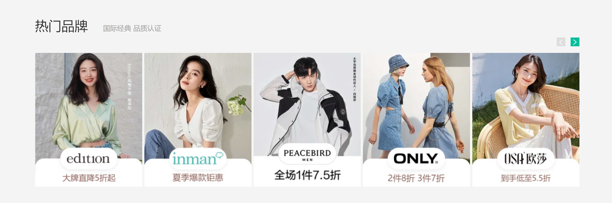

# day10-小兔鲜儿

## 底部盒子制作

~~~html
  <!-- 底部开始 -->
  <div class="footer">
    <div class="wrapper">
     
    </div>
  </div>
  <!-- 底部结束 -->
~~~

~~~css
.footer {
  height: 582px;
  background-color: #F5F5F5;
}

~~~

### 底部服务模块制作

html

~~~html
<!-- 服务 service -->
<div class="service">
  <ul>
    <li>
      <h5>省</h5>
      <p>价格亲民</p>
    </li>
    <li>
      <h5>省</h5>
      <p>价格亲民</p>
    </li>
    <li>
      <h5>省</h5>
      <p>价格亲民</p>
    </li>
    <li>
      <h5>省</h5>
      <p>价格亲民</p>
    </li>
  </ul>
</div>
~~~

~~~css
.service {
  padding: 60px 0;
  border-bottom: 1px solid #E8E8E8;
}

.service ul {
  display: flex;
  /* 缝隙相同 */
  justify-content: space-evenly;
}

.service li {
  display: flex;
  /* width: 190px; */
  height: 58px;
  /* background-color: pink; */

}

.service li h5 {
  overflow: hidden;
  width: 58px;
  height: 58px;
  margin-right: 20px;
  background: url(../images/sprite.png);
  text-indent: -999em;
  transition: all .3s;
}

.service li p {
  font-size: 28px;
  line-height: 58px;
}

.service li:nth-child(2) h5 {
  background-position: 0 -58px;
}

.service li:nth-child(2) h5:hover {
  background-position: 0 -116px;
}

.service li:nth-child(3) h5 {
  background-position: 0 -116px;
}

.service li:nth-child(4) h5 {
  background-position: 0 -174px;
}

~~~

### 底部帮助模块

html

~~~html
<!-- 帮助模块 help -->
<div class="help">
  <div class="left">
    <dl>
      <dt>购物方式</dt>
      <dd><a href="#">购物流程</a></dd>
      <dd><a href="#">支付方式</a></dd>
      <dd><a href="#">售后规则</a></dd>
    </dl>
    <dl>
      <dt>购物方式</dt>
      <dd><a href="#">购物流程</a></dd>
      <dd><a href="#">支付方式</a></dd>
      <dd><a href="#">售后规则</a></dd>
    </dl>
    <dl>
      <dt>购物方式</dt>
      <dd><a href="#">购物流程</a></dd>
      <dd><a href="#">支付方式</a></dd>
      <dd><a href="#">售后规则</a></dd>
    </dl>
    <dl>
      <dt>购物方式</dt>
      <dd><a href="#">购物流程</a></dd>
      <dd><a href="#">支付方式</a></dd>
      <dd><a href="#">售后规则</a></dd>
    </dl>
    <dl>
      <dt>购物方式</dt>
      <dd>
        <a href="#">在线客服</a>
        <span class="iconfont icon-customer-service"></span>
      </dd>
      <dd><a href="#">客服电话 400-0000-000</a></dd>
      <dd><a href="#">工作时间 周一至周日 8:00-18:00</a></dd>
    </dl>
  </div>
  <!-- 右侧 -->
  <div class="right">
    <ul>
      <li>
        
        <p>微信公众号</p>
      </li>
      <li>
        
        <p>APP下载二维码</p>
      </li>
    </ul>
  </div>
</div>
~~~

css

~~~css
/* 帮助 */
.help {
  display: flex;
  justify-content: space-between;
  height: 300px;
  padding-top: 60px;
  /* background-color: pink; */
}

.help .left {
  display: flex;
}

.help .left dl {
  margin-right: 80px;
}

.help .left dt {
  font-size: 18px;
  margin-bottom: 30px;
}

.help .left dd {
  margin-bottom: 10px;
}

.help .left dd a {
  font-size: 16px;
  color: var(--hui);
}

.help .left dd a:hover {
  text-decoration: underline;
}

.help .left dd span {
  color: var(--lv);
}

.help .right ul {
  display: flex;
}

.help .right li:last-child {
  margin-left: 55px;
}

.help .right li img {
  width: 120px;
  height: 120px;
}

.help .right p {
  margin-top: 10px;
  color: var(--hui);
  text-align: center;
}

~~~

### 底部版权模块

html

~~~html
<!-- 底部版权 -->
<div class="copyright">
  <p>
    <a href="#">关于我们</a> <span>|</span>
    <a href="#">帮助中心</a> <span>|</span>
    <a href="#">售后服务</a> <span>|</span>
    <a href="#">配送与验收</a> <span>|</span>
    <a href="#">商务合作</a> <span>|</span>
    <a href="#">搜索推荐</a> <span>|</span>
    <a href="#">友情链接</a>
  </p>
  <p>CopyRight © 小兔鲜</p>
</div>
~~~

css

~~~css
.copyright {
  text-align: center;
  line-height: 30px;
  color: var(--hui);
}

.copyright a {
  color: var(--hui);
}

.copyright a:hover {
  color: var(--lv);
}

.copyright span {
  margin: 0 5px;
}
~~~

## 01-banner-轮播图


> 注意此时开始要写到  index.css  里面哦 

### HTML结构

```html
  <!-- banner开始 -->
  <div class="banner">
    <div class="wrapper">
     
    </div>
  </div>
  <!-- banner结束 -->
```

### CSS样式

```css
/* banner 开始 */
.banner {
  height: 500px;
  background-color: #F5F5F5;
}

.banner .wrapper {
  position: relative;
  /* 溢出隐藏 */
  overflow: hidden;
  height: 500px;
}
```

## banner 图片模块

### html

~~~html
<!-- 轮播图图片 -->
<ul>
  <li><a href="#"></a></li>
  <li><a href="#"></a></li>
  <li><a href="#"></a></li>
</ul>
<!-- 小圆点 -->
~~~

### css

~~~css
.banner .wrapper>ul {
  display: flex;
  width: 300%;
  /* width: 3720px; */
}

~~~

## banner 小圆点制作

### html

~~~html
<!-- 小圆点 -->
<ol class="circle">
  <li></li>
  <li class="active"></li>
  <li></li>
</ol>
~~~

### css

~~~css
.banner .circle {
  display: flex;
  position: absolute;
  bottom: 10px;
  right: 10px;
}

.banner .circle li {
  width: 22px;
  height: 22px;
  padding: 4px;
  margin-left: 10px;
  /* background-color: pink; */
  border-radius: 50%;
  /* 小手 */
  cursor: pointer;
}

.banner .circle .active {
  background-color: rgba(255, 255, 255, 0.5);
}

.banner .circle li::after {
  content: "";
  /* 转换块级才有大小 */
  display: block;
  width: 14px;
  height: 14px;
  background-color: #fff;
  border-radius: 50%;
}

~~~

## 02-banner-侧导航

### HTML结构

```html
<!-- 侧边栏 -->
<div class="subnav">
  <ul>
    <li>
      <a href="#">生鲜</a>
      <a href="#">水果</a>
      <a href="#">蔬菜</a>
    </li>
    <li>
      <a href="#">美食</a>
      <a href="#">面点</a>
      <a href="#">干果</a>

    </li>
    <li>
      <a href="#">餐厨</a>
      <a href="#">数码产品</a>  
    </li>
    <li>
      <a href="#">电器</a>
      <a href="#">床品</a>
      <a href="#">四件套</a>
      <a href="#">被枕</a>  
    </li>
    <li>
      <a href="#">居家</a>
      <a href="#">奶粉</a>
      <a href="#">玩具</a>
      <a href="#">辅食</a>  
    </li>
    <li>
      <a href="#">洗护</a>
      <a href="#">洗发</a>
      <a href="#">洗护</a>
      <a href="#">美妆</a>  
    </li>
    <li>
      <a href="#">孕婴</a>
      <a href="#">奶粉</a>
      <a href="#">玩具</a>  
    </li>
    <li>
      <a href="#">服饰</a>
      <a href="#">女装</a>
      <a href="#">男装</a>  
    </li>
    <li>
      <a href="#">杂货</a>
      <a href="#">户外</a>
      <a href="#">图书</a>  
    </li>
    <li>
      <a href="#">品牌</a>
      <a href="#">品牌制造</a>  
    </li>
  </ul>
</div>
```

### CSS样式

```css
.banner .subnav {
  position: absolute;
  left: 0;
  top: 0;
  width: 250px;
  height: 500px;
  background-color: rgba(0, 0, 0, .42)
}

.banner .subnav li {
  position: relative;
  height: 50px;
  padding-left: 29px;
  line-height: 50px;
  /* background-color: pink; */
}

.banner .subnav li::after {
  /* 到iconfont.css 里面去复制 */
  content: "\e687";
  position: absolute;
  top: 0px;
  right: 29px;
  color: #fff;
  /* 声明字体图标的字体 */
  font-family: iconfont;
}

.banner .subnav li:hover {
  background-color: var(--lv);
}

.banner .subnav li a {
  color: #fff;
  font-size: 14px;
}

.banner .subnav li a:first-child {
  font-size: 16px;
  margin-right: 5px;
}

```

## 04-新鲜好物-hd


> 考虑公共样式

### HTML结构

```html
<div class="wrapper">
  <!-- 上侧 hd  -->
  <div class="hd">
    <h2>新鲜好物
      <span>新鲜出炉 品质靠谱</span>
    </h2>
    <a href="#" class="all">
      查看全部
      <i class="iconfont icon-arrow-right-bold"></i>
    </a>
  </div>
</div>
```

### CSS样式

```css
/* 新鲜好物 */
/* 新鲜好物 */
.hd {
  display: flex;
  justify-content: space-between;
  /* 侧轴垂直居中 */
  align-items: center;
  padding: 40px 0 30px;

}

.hd h2 {
  font-size: 30px;
}

.hd h2 span {
  font-size: 16px;
  color: var(--hui);
  margin-left: 30px;
}

.hd .all {
  font-size: 16px;
  color: var(--hui);
}

.hd .all:hover {
  color: var(--lv);
}

```

## 05-新鲜好物-bd

### HTML结构

```html
<!-- 下部分 bd  -->
    <div class="bd">
      <ul>
        <li>
          <a href="#" title="KN95级莫兰迪色防护口罩">
            <div class="pic">
              
            </div>
            <h4 class="text-overflow">KN95级莫兰迪色防护口罩你值得拥有</h4>
            <p>¥ <span>99.00</span></p>
          </a>
        </li>
        <li>
          <a href="#" title="KN95级莫兰迪色防护口罩">
            <div class="pic">
              
            </div>
            <h4 class="text-overflow">KN95级莫兰迪色防护口罩你值得拥有</h4>
            <p>¥ <span>99.00</span></p>
          </a>
        </li>
        <li>
          <a href="#" title="KN95级莫兰迪色防护口罩">
            <div class="pic">
              
            </div>
            <h4 class="text-overflow">KN95级莫兰迪色防护口罩你值得拥有</h4>
            <p>¥ <span>99.00</span></p>
          </a>
        </li>
        <li>
          <a href="#" title="KN95级莫兰迪色防护口罩">
            <div class="pic">
              
            </div>
            <h4 class="text-overflow">KN95级莫兰迪色防护口罩你值得拥有</h4>
            <p>¥ <span>99.00</span></p>
          </a>
        </li>
      </ul>
    </div>
```

### CSS样式

```css
/* 好物内容 -- 公共样式 */

.bd ul {
  display: flex;
  justify-content: space-between;
}

.bd ul li {
  width: 304px;
  height: 404px;
  background-color: #EEF9F4;
  text-align: center;
  transition: all .3s;
}

.bd ul li:hover {
  margin-top: -5px;
  box-shadow: 0 15px 30px rgba(0, 0, 0, .42);
}

.bd ul li a {
  display: block;
  height: 100%;
}

.bd ul li .pic {
  width: 304px;
  height: 304px;
  background-color: skyblue;
}

.bd ul li h4 {
  font-size: 20px;
  margin: 18px 15px 9px;

}

.bd ul li p {
  color: #AA2113;
  font-size: 17px;
}

.bd ul li p span {
  font-size: 22px;
}
```

## 溢出文字显示省略号

 

~~~html
<!DOCTYPE html>
<html lang="en">

<head>
  <meta charset="UTF-8">
  <meta http-equiv="X-UA-Compatible" content="IE=edge">
  <meta name="viewport" content="width=device-width, initial-scale=1.0">
  <title>Document</title>
  <style>
    .box {
      width: 200px;
      height: 40px;
      border: 1px solid pink;
      /* 1. 不允许文字换行  强制文字一行显示*/
      white-space: nowrap;
      /* 2. 溢出隐藏 */
      overflow: hidden;
      /* 3. 文字溢出用省略号代替 */
      text-overflow: ellipsis;
    }
  </style>
</head>

<body>
  <div class="box">里面多的文字123要显示省略号哦</div>
</body>

</html>
~~~


## 06-人气推荐


### HTML结构

```html
<!-- 人气推荐 -->
 <!-- 人气推荐 -->
  <div class="wrapper recommend">
    <!-- 上侧 hd  -->
    <div class="hd">
      <h2>人气推荐
        <span>人气爆款 不容错过</span>
      </h2>

    </div>
    <!-- 下部分 bd  -->
    <div class="bd">
      <ul>
        <li>
          <a href="#" title="KN95级莫兰迪色防护口罩">
            <div class="pic">
              
            </div>
            <h4 class="text-overflow">特惠推荐</h4>
            <p>我猜得到 你的需要</p>
          </a>
        </li>
        <li>
          <a href="#" title="KN95级莫兰迪色防护口罩">
            <div class="pic">
              
            </div>
            <h4 class="text-overflow">特惠推荐</h4>
            <p>我猜得到 你的需要</p>
          </a>
        </li>
        <li>
          <a href="#" title="KN95级莫兰迪色防护口罩">
            <div class="pic">
              
            </div>
            <h4 class="text-overflow">特惠推荐</h4>
            <p>我猜得到 你的需要</p>
          </a>
        </li>
        <li>
          <a href="#" title="KN95级莫兰迪色防护口罩">
            <div class="pic">
              
            </div>
            <h4 class="text-overflow">特惠推荐</h4>
            <p>我猜得到 你的需要</p>
          </a>
        </li>
      </ul>
    </div>
  </div>

```

### CSS样式

```css
.recommend .bd li {
  background-color: #fff;
}

.recommend .bd li p {
  font-size: 16px;
  color: var(--hui);
}
```

## 07-热门品牌-布局



### HTML结构

```html
<!-- 热门品牌 brand -->
  <div class="brand">
    <div class="wrapper">
      <!-- hd  -->
      <div class="hd">
        <h2>热门品牌
          <span>国际经典 品质认证</span>
        </h2>

      </div>
    </div>
  </div>
```

### CSS样式

```css
/* 热门品牌 */
.brand {
  height: 468px;
  background-color: #f5f5f5;
}
```

## 热门品牌-头部右侧制作

html

~~~html
<!-- hd  -->
<div class="hd">
  <h2>热门品牌
    <span>国际经典 品质认证</span>
  </h2>
  <!-- 按钮   button-->
  <div class="btn">
    <a href="javascript:;" class="btnleft">
      <i class="iconfont icon-arrow-left-bold"></i>
    </a>
    <a href="javascript:;" class="btnright">
      <i class="iconfont icon-arrow-right-bold"></i>
    </a>
  </div>
</div>
~~~

css

~~~css
/* brand里面的hd 加相对定位 */
.brand .hd {
  position: relative;
}

.brand .btn {
  position: absolute;
  top: 85px;
  right: 0;
  display: flex;

}

.brand .btn a {
  width: 20px;
  height: 20px;
  background-color: #e2e2e2;
  margin-left: 12px;
  text-align: center;
  line-height: 20px;
  color: #fff;
}

.brand .btn .btnright {
  background-color: var(--lv);
}
~~~


## 热门品牌-内容

### HTML结构

```html
  <!-- 热门品牌 brand -->
  <div class="brand">
    <div class="wrapper">
      <!-- hd  -->
      <div class="hd">
        <h2>热门品牌
          <span>国际经典 品质认证</span>
        </h2>
        <!-- 按钮   button-->
        <div class="btn">
          <a href="javascript:;" class="btnleft">
            <i class="iconfont icon-arrow-left-bold"></i>
          </a>
          <a href="javascript:;" class="btnright">
            <i class="iconfont icon-arrow-right-bold"></i>
          </a>
        </div>
      </div>
      <!-- bd  -->
      <div class="bd">
        <ul>
          <li><a href="#"></a></li>
          <li><a href="#"></a></li>
          <li><a href="#"></a></li>
          <li><a href="#"></a></li>
          <li><a href="#"></a></li>
        </ul>
      </div>
    </div>
  </div>
```

### CSS样式

```css
/* 热门品牌 */
.brand {
  height: 468px;
  background-color: #f5f5f5;
  margin-top: 50px;
}

/* brand里面的hd 加相对定位 */
.brand .hd {
  position: relative;
}

.brand .btn {
  position: absolute;
  top: 80px;
  right: 0;
  display: flex;

}

.brand .btn a {
  width: 20px;
  height: 20px;
  background-color: #e2e2e2;
  margin-left: 12px;
  text-align: center;
  line-height: 20px;
  color: #fff;
}

.brand .btn .btnright {
  background-color: var(--lv);
}

.brand .bd li {
  width: 244px;
  height: 306px;
}

```

## 生鲜-标题


### HTML结构

```html
<!-- 生鲜模块 -->
  <div class="wrapper">
    <!-- 上侧 hd  -->
    <div class="hd">
      <h2>生鲜</h2>
      <ul>
        <li><a href="#">热门</a></li>
        <li><a href="#">蔬菜</a></li>
        <li><a href="#">肉禽蛋</a></li>
        <li><a href="#">水果</a></li>
        <li><a href="#">海鲜</a></li>
        <li><a href="#">零食</a></li>
        <li><a href="#">饮料</a></li>
      </ul>

      <a href="#" class="all">
        查看全部
        <i class="iconfont icon-arrow-right-bold"></i>
      </a>
    </div>
  </div>

```

### CSS样式

```css
/* 生鲜 */
.hd ul {
  display: flex;
}
```

## 生鲜头部制作完成

html

~~~html
 <!-- 上侧 hd  -->
    <div class="hd">
      <h2>生鲜</h2>
      <ul>
        <li><a href="#">热门</a></li>
        <li><a href="#">蔬菜</a></li>
        <li><a href="#">肉禽蛋</a></li>
        <li><a href="#">水果</a></li>
        <li><a href="#">海鲜</a></li>
        <li><a href="#">零食</a></li>
        <li><a href="#">饮料</a></li>
        <li><a href="#">海鲜</a></li>
        <li><a href="#">零食</a></li>
        <li><a href="#">饮料</a></li>
      </ul>

      <a href="#" class="all">
        查看全部
        <i class="iconfont icon-arrow-right-bold"></i>
      </a>
    </div>
~~~

css

~~~css
/* 让生鲜模块里面的li 一行显示 */
.hd ul {
  display: flex;
  margin-right: 65px;
}

.hd ul li {
  margin-right: 13px;
}

.hd ul li a {
  padding: 0 5px;
}

/* 鼠标经过添加底色和文字颜色 */
.hd ul li a:hover {
  background-color: var(--lv);
  color: #fff;
}

.fresh .hd h2 {
  flex: 1;
}
~~~

## 生鲜-内容布局

### HTML结构

```html
<!-- 内容区域 -->
<div class="content">
  <div class="left">
    <a href="#"></a>
  </div>
  <div class="right"></div>
</div>
```

### CSS样式

```css
/* 生鲜内容 */
/* 内容区域 */
.fresh .content {
  display: flex;
  justify-content: space-between;
}

.fresh .content .left {
  width: 248px;
  height: 610px;
  /* background-color: pink; */
}

.fresh .content .right {
  width: 968px;
  height: 610px;
  background-color: skyblue;
}
```

## 生鲜-内容小li搭建

html

~~~html
<div class="right">
  <ul>
    <li>1</li>

  </ul>
</div>
~~~

css

~~~css
.fresh .content .right {
  width: 968px;
  height: 610px;
  background-color: skyblue;
}

.fresh .content .right ul {
  display: flex;
  /* 强制换行 */
  flex-wrap: wrap;
}

.fresh .content .right li {
  width: 242px;
  height: 304px;
  background-color: pink;
  /* 颜色透明 transparent */
  border: 2px solid transparent;
}

.fresh .content .right li:hover {
  /* border: 2px solid var(--lv); */
  border-color: var(--lv);
}
~~~


## 生鲜-产品内容

### HTML结构

```html
 <!-- 内容区域 -->
    <div class="content">
      <div class="left">
        <a href="#"></a>
      </div>
      <div class="right">
        <ul>
          <li>
            <a href="#">
              <!-- 图片 -->
              <div class="pic">
                
              </div>
              <!-- 信息 -->
              <div class="info">
                <h5>双味千层，手抓饼烤肉组合</h5>
                <p>240g/袋 4片装</p>
                <p>加热即食</p>
              </div>
              <!-- 价格  -->
              <div class="price">
                ¥ <span>88.99</span>
              </div>
            </a>
            <!-- 发现更多宝贝 -->
            <div class="find">
              <h4>找相似</h4>
              <a href="#">
                发现更多宝贝
                <i class="iconfont icon-arrow-right-bold"></i>
              </a>
            </div>
          </li>
        </ul>
      </div>
    </div>
```

### CSS样式

```css

/* 内容区域 */
.fresh .content {
  display: flex;
  justify-content: space-between;
}

.fresh .content .left {
  width: 248px;
  height: 610px;
  /* background-color: pink; */
}

.fresh .content .right {
  width: 968px;
  height: 610px;
  /* background-color: skyblue; */
}

.fresh .content .right ul {
  display: flex;
  /* 强制换行 */
  flex-wrap: wrap;
}

.fresh .content .right li {
  overflow: hidden;
  position: relative;
  width: 242px;
  height: 304px;
  /* background-color: pink; */
  /* 颜色透明 transparent */
  border: 2px solid transparent;

}

.fresh .content .right li:hover {
  /* border: 2px solid var(--lv); */
  border-color: var(--lv);
}

.fresh .content .right li>a {
  display: block;
  height: 100%;
  padding: 10px 0 0 20px;
}

.fresh .content .pic {
  width: 200px;
  height: 180px;
  background-color: purple;
}

.fresh .content .info {
  margin-top: 14px;
  font-size: 16px;
  line-height: 19px;

}

.fresh .content .info h5 {
  font-size: 16px;
}

.fresh .content .price {
  margin-top: 5px;
  font-size: 15px;
  color: #AF2F22;
}

.fresh .content .price span {
  font-size: 22px;
}

.fresh .content .find {
  position: absolute;
  left: 0;
  bottom: -84px;
  width: 242px;
  height: 84px;
  background-color: var(--lv);
  padding: 15px 55px 0;
  text-align: center;
  /* 谁做动画（过渡）给谁加 */
  transition: all .3s;
}

.fresh .content .right li:hover .find {
  bottom: 0;
}

.fresh .content .find h4 {
  border-bottom: 2px solid rgba(255, 255, 255, 0.11);
  color: #fff;
  padding-bottom: 4px;
  margin-bottom: 4px;
  font-size: 18px;
}

.fresh .content .find a {
  color: #fff;
  font-size: 13px;
}

.fresh .content .find a i {
  font-size: 13px;
}
```


## 快捷键

> 全部折叠：
>
> 先按 ctrl + k   接着   ctrl + 0     
>
> 全部展开：
>
> ctrl+ k   接着 ctrl+ j


## 最新专题-布局


### HTML结构

```html
<!-- 最新专题 -->
<!-- 最新专题 -->
  <div class="wrapper news">
    <!-- 上侧 hd  -->
    <div class="hd">
      <h2>最新专题
      </h2>
      <a href="#" class="all">
        查看全部
        <i class="iconfont icon-arrow-right-bold"></i>
      </a>
    </div>
    <!-- 下部分 bd  -->
    <div class="bd">
      <ul>
        <li>
          <div class="pic">
            
          </div>
        </li>

      </ul>
    </div>
  </div>

```

### CSS样式

```css
/* 最新专题 */
/* 最新专题 */
.news {
  margin-bottom: 50px;
}

.news .bd ul li {
  width: 405px;
  height: 355px;
  background-color: pink;
}

.news .bd ul li .pic {
  width: 405px;
  height: 288px;
  background-color: skyblue;
}
```

## 最新专题-内容

### HTML结构

```html
<ul>
  <li>
    <a href="#">
      <div class="pic">
        
      </div>
      <div class="txt">
        <div class="left">
          <p>
            <i class="iconfont icon-favorites-fill"></i>
            <span>1220</span>
          </p>
          <p>
            <i class="iconfont icon-browse"></i>
            <span>1800</span>
          </p>
        </div>
        <div class="right">
          <p>
            <i class="iconfont icon-comment"></i>
            <span>246</span>
          </p>
        </div>
      </div>
    </a>
  </li>
  <li>
    <a href="#">
      <div class="pic">
        
      </div>
      <div class="txt">
        <div class="left">
          <p>
            <i class="iconfont icon-favorites-fill"></i>
            <span>1220</span>
          </p>
          <p>
            <i class="iconfont icon-browse"></i>
            <span>1800</span>
          </p>
        </div>
        <div class="right">
          <p>
            <i class="iconfont icon-comment"></i>
            <span>246</span>
          </p>
        </div>
      </div>
    </a>
  </li>
  <li>
    <a href="#">
      <div class="pic">
        
      </div>
      <div class="txt">
        <div class="left">
          <p>
            <i class="iconfont icon-favorites-fill"></i>
            <span>1220</span>
          </p>
          <p>
            <i class="iconfont icon-browse"></i>
            <span>1800</span>
          </p>
        </div>
        <div class="right">
          <p>
            <i class="iconfont icon-comment"></i>
            <span>246</span>
          </p>
        </div>
      </div>
    </a>
  </li>
</ul>
```

### CSS样式

```css
.topic-bd ul {
  display: flex;
  justify-content: space-between;
}

.topic-bd li {
  width: 405px;
  height: 355px;
  background-color: pink;
}

.topic-bd .pic {
  position: relative;
  width: 405px;
  height: 288px;
}

.topic-bd .txt {
  display: flex;
  justify-content: space-between;
  align-items: center;
  padding: 0 15px;
  width: 405px;
  height: 67px;
  /* background-color: skyblue; */
  font-size: 14px;
  color: #666;
}

.topic-bd .txt .left {
  display: flex;
}

.topic-bd .txt .left p {
  margin-right: 20px;
}

.topic-bd .txt .left p:nth-child(1) i {
  color: #AA2113;
}
```


## 最新专题完成

~~~html
  <!-- 最新专题 -->
  <div class="wrapper news">
    <!-- 上侧 hd  -->
    <div class="hd">
      <h2>最新专题
      </h2>
      <a href="#" class="all">
        查看全部
        <i class="iconfont icon-arrow-right-bold"></i>
      </a>
    </div>
    <!-- 下部分 bd  -->
    <div class="bd">
      <ul>
        <li>
          <!-- 图片区域 -->
          <div class="pic">
            

            <div class="txt">
              <div class="left">
                <h5>吃这些美食才不算辜负自己</h5>
                <p>餐厨起居洗护好物</p>
              </div>
              <div class="right">
                ¥29.99
              </div>
            </div>
          </div>
          <!-- 说明区域 -->
          <div class="desc">
            <p>
              <span>
                <i class="iconfont icon-fabulous"></i>
                1200
              </span>
              <span>
                <i class="iconfont icon-browse"></i>
                1800
              </span>
            </p>
            <p>

              <span>
                <i class="iconfont icon-comment"></i>
                246
              </span>
            </p>
          </div>
        </li>
        <li>
          <!-- 图片区域 -->
          <div class="pic">
            

            <div class="txt">
              <div class="left">
                <h5>吃这些美食才不算辜负自己</h5>
                <p>餐厨起居洗护好物</p>
              </div>
              <div class="right">
                ¥29.99
              </div>
            </div>
          </div>
          <!-- 说明区域 -->
          <div class="desc">
            <p>
              <span>
                <i class="iconfont icon-fabulous"></i>
                1200
              </span>
              <span>
                <i class="iconfont icon-browse"></i>
                1800
              </span>
            </p>
            <p>

              <span>
                <i class="iconfont icon-comment"></i>
                246
              </span>
            </p>
          </div>
        </li>
        <li>
          <!-- 图片区域 -->
          <div class="pic">
            

            <div class="txt">
              <div class="left">
                <h5>吃这些美食才不算辜负自己</h5>
                <p>餐厨起居洗护好物</p>
              </div>
              <div class="right">
                ¥29.99
              </div>
            </div>
          </div>
          <!-- 说明区域 -->
          <div class="desc">
            <p>
              <span>
                <i class="iconfont icon-fabulous"></i>
                1200
              </span>
              <span>
                <i class="iconfont icon-browse"></i>
                1800
              </span>
            </p>
            <p>

              <span>
                <i class="iconfont icon-comment"></i>
                246
              </span>
            </p>
          </div>
        </li>
      </ul>
    </div>
  </div>
~~~

css

~~~css
/* 最新专题 */
.news {
  margin-bottom: 50px;
}

.news .bd ul li {
  width: 405px;
  height: 355px;
  background-color: #fff;
}

.news .bd ul li .pic {
  position: relative;
  width: 405px;
  height: 288px;
  /* background-color: skyblue; */
}

.news .pic .txt {
  position: absolute;
  left: 0;
  bottom: 0;
  display: flex;
  justify-content: space-between;
  align-items: center;
  width: 405px;
  height: 90px;
  /* background-color: skyblue; */
  padding: 20px 15px 0;
  text-align: left;
  /* 渐变色  从红色到绿色  竖着*/
  /* background-image: linear-gradient(red, green); */
  /* background-image: linear-gradient(transparent, rgba(0, 0, 0, 0.6)); */
  background-image: linear-gradient(rgba(0, 0, 0, 0), rgba(0, 0, 0, 0.6));
}

.news .pic .txt h5 {
  font-size: 20px;
  color: #fff;
  margin-bottom: 5px;
}

.news .pic .txt .left p {
  color: #fff;
}

.news .pic .right {
  width: 79px;
  height: 25px;
  background-color: #fff;
  text-align: center;
  line-height: 25px;
  color: #AA2113;
}

.news .bd .desc {
  display: flex;
  justify-content: space-between;
  padding: 20px 15px;

}

.news .bd .desc p span {
  color: #666;
  font-size: 14px;
  margin-right: 5px;
}
~~~


